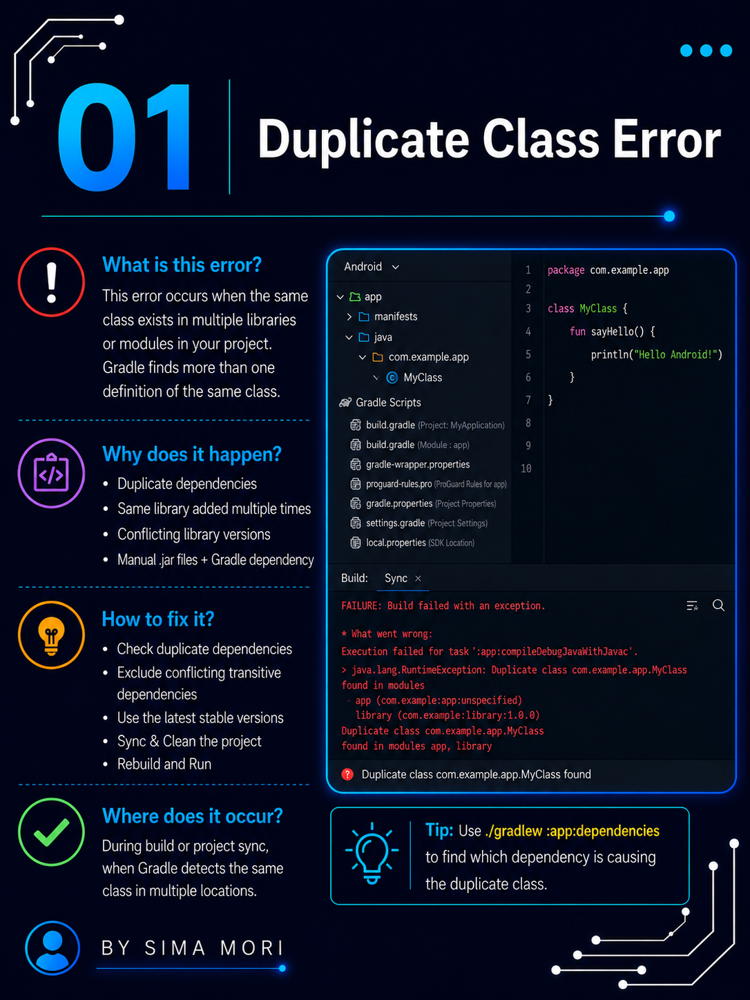

# 🚀 Episode 05: Duplicate Class Error

## 📌 Error

```
Duplicate class found
```

## ❓ Why This Error Occurs

This error occurs when the same class exists in multiple libraries or dependencies included in the Android project.

Common reasons include:

- Duplicate dependencies in the project.
- Different library versions containing the same class.
- Conflicting Gradle dependencies.
- Multiple modules including the same library.

## ❌ Common Issue

```text
Duplicate class com.example.ClassName found in modules...
```

## ✅ Correct Approach

```gradle
implementation("library-name:version")
```

Remove duplicate or conflicting dependencies and use only one compatible version of the library.

## 🛠️ Solution

- Check the Gradle build output for the duplicate class.
- Identify the conflicting dependencies.
- Remove duplicate libraries.
- Use compatible dependency versions.
- Sync the project with Gradle files.
- Clean and Rebuild the project.

## 📷 Screenshots

### Welcome 


### Error 


### Explanation 


### Solutions 


### Tips


### Summary 


### Thanks


---

⭐ If this repository helped you, don't forget to **Star** it!

Happy Coding! 🚀
