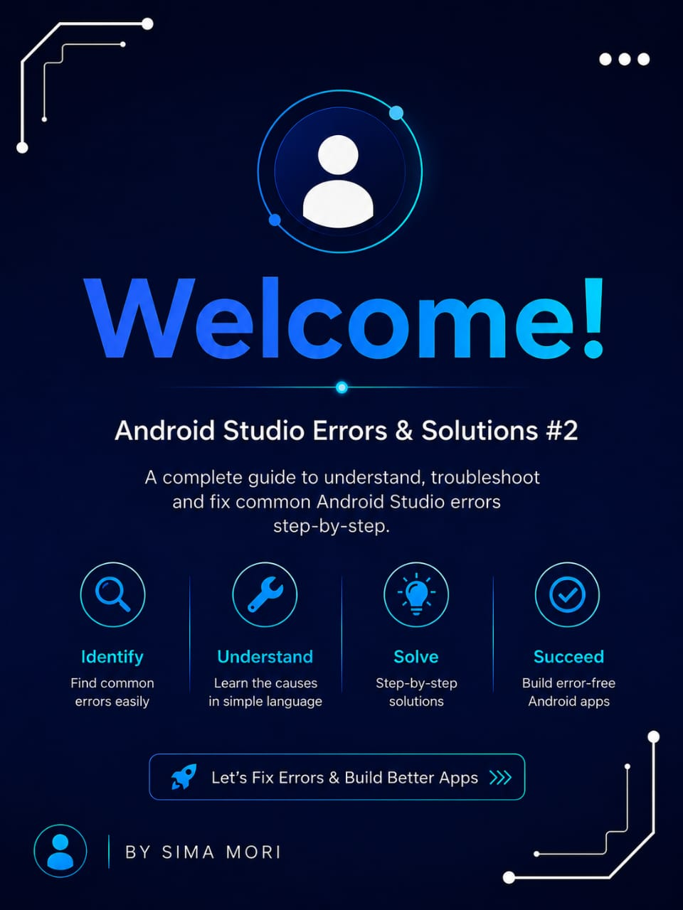
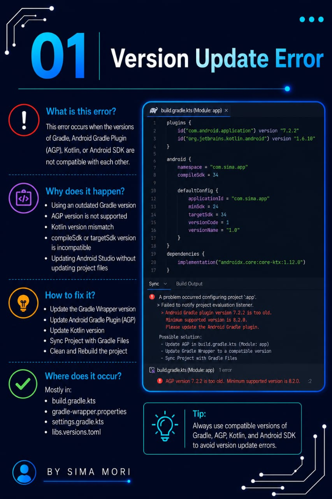
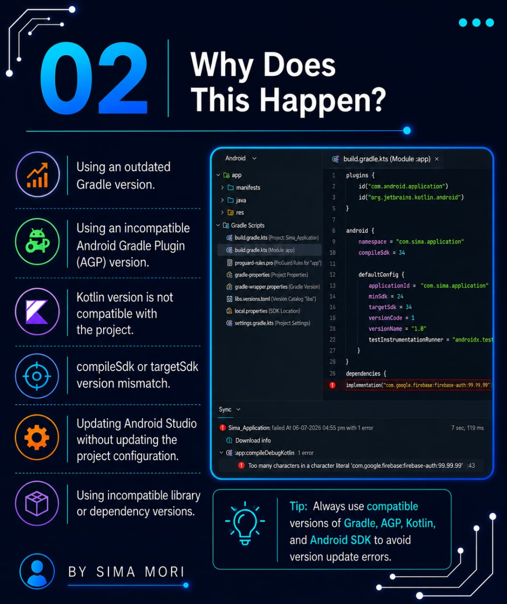
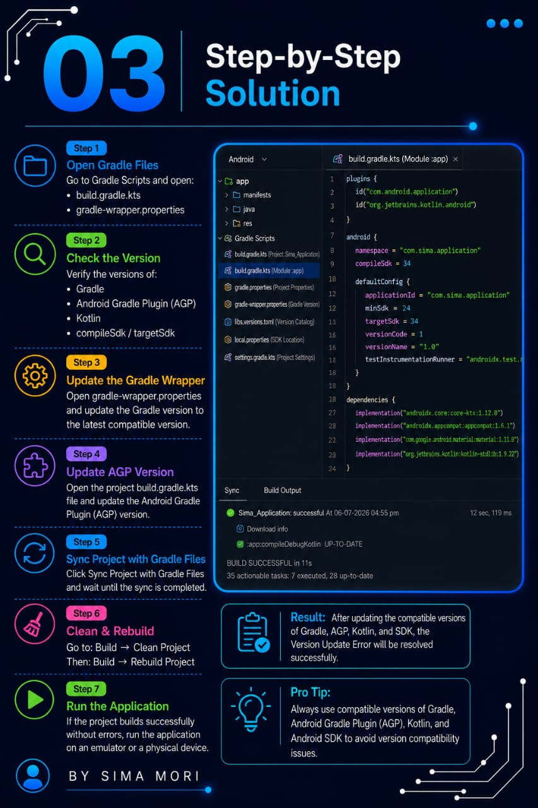
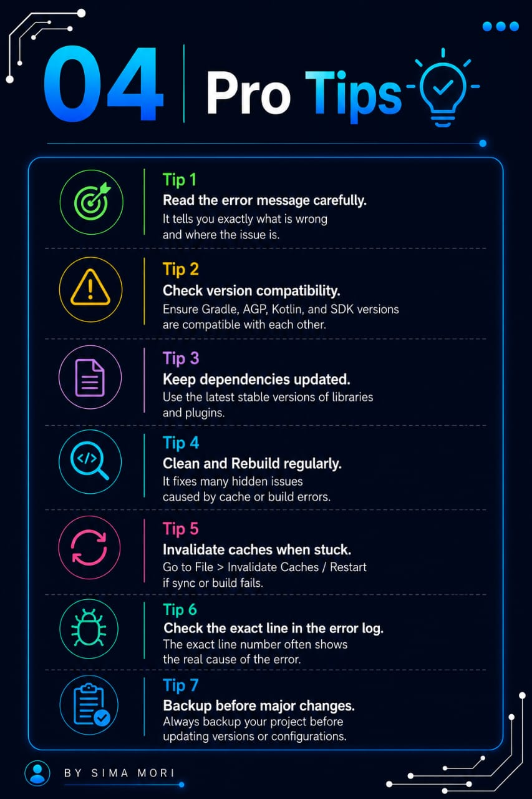
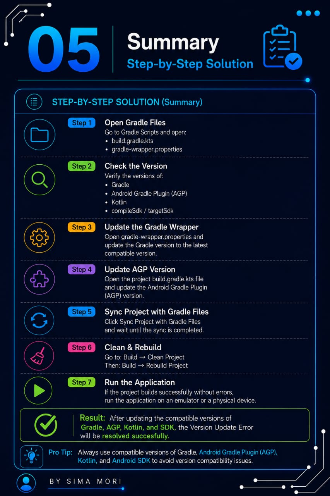

# 🚀 Episode 02: Version Update Error

## 📌 Error

```
Version Update Error
```

## ❓ Why This Error Occurs

This error occurs when the Android Gradle Plugin, Gradle version, Kotlin version, SDK version, or project dependencies are outdated or incompatible with each other.

In Android Studio:

- Android Gradle Plugin and Gradle versions must be compatible.
- Outdated SDK or dependencies can cause build failures.
- Version mismatches between libraries may prevent the project from compiling successfully.

## ❌ Common Issue

```gradle
classpath 'com.android.tools.build:gradle:7.0.0'
```

## ✅ Correct Approach

```gradle
classpath 'com.android.tools.build:gradle:<compatible-version>'
```

Update the Android Gradle Plugin, Gradle Wrapper, SDK, and project dependencies to compatible versions.

## 🛠️ Solution

- Update the Android Gradle Plugin.
- Use a compatible Gradle version.
- Update the Gradle Wrapper.
- Update Kotlin and project dependencies.
- Sync the project with Gradle files.
- Clean and Rebuild the project.
- Restart Android Studio if required.

## 📷 Screenshots

### Error


### Explanation


### Solution


### Example


### Output


### Fix Applied


### Thanks


---

⭐ If this repository helped you, don't forget to **Star** it!

Happy Coding! 🚀
