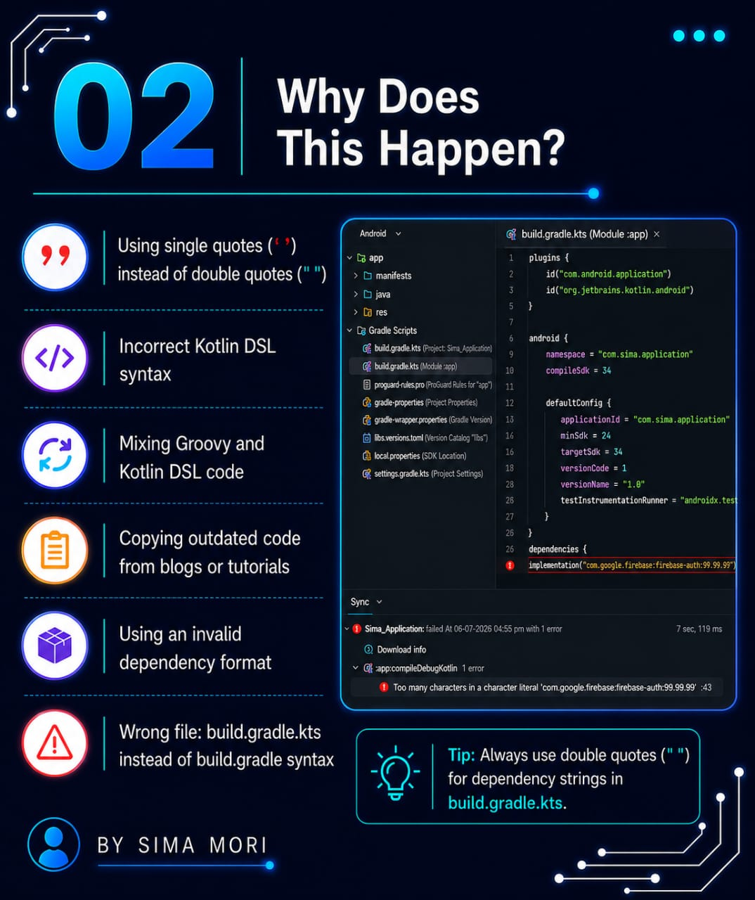
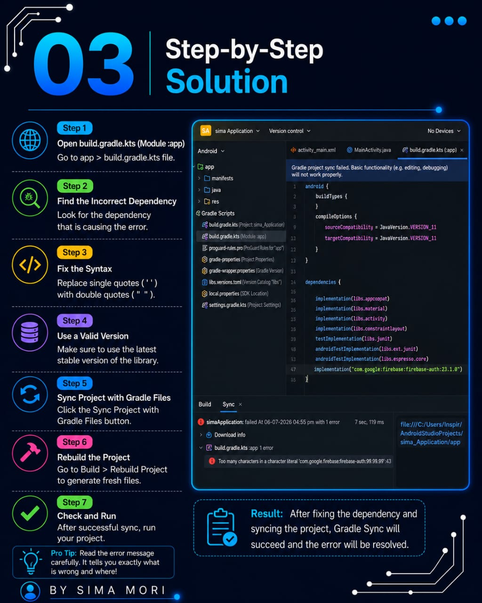
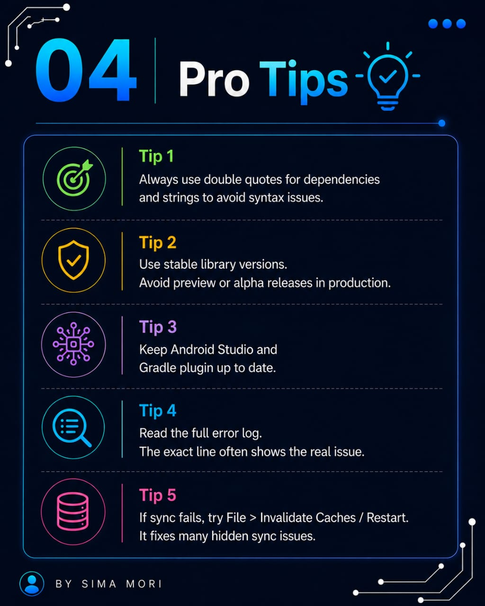
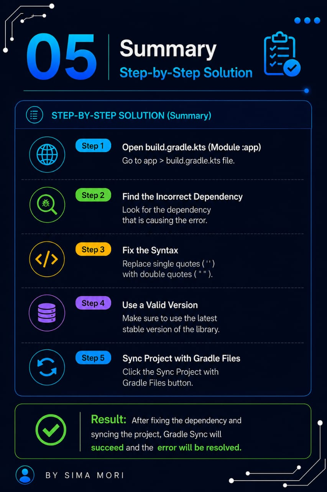
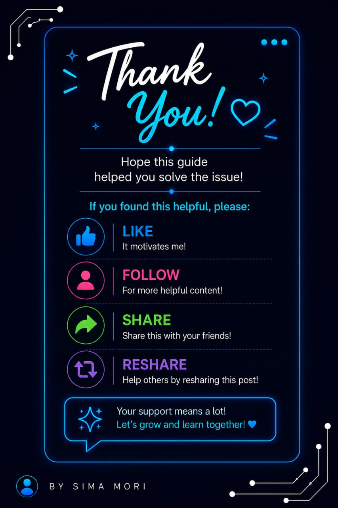

# 🚀 Android Studio Errors & Solutions

A collection of common Android Studio errors with clear explanations, causes, and step-by-step solutions to help Android developers troubleshoot issues quickly.

---

# 📌 Episode 01 – Gradle Sync Failed

Gradle Sync Failed is one of the most common errors in Android Studio. This repository explains the error with easy-to-understand infographics, common causes, practical solutions, and useful tips.

---

# 📖 What's Included

- ✅ Welcome
- ✅ What is Gradle Sync Failed?
- ✅ Why does it happen?
- ✅ Step-by-step solution
- ✅ Pro Tips
- ✅ Summary

---

# 🖼️ Preview

## Welcome

---

## 1️⃣ Gradle Sync Failed

---

## 2️⃣ Why Does This Happen?

---

## 3️⃣ Step-by-Step Solution

---

## 4️⃣ Pro Tips

---

## 5️⃣ Summary

---

# 💡 Common Causes

- No internet connection
- Corrupted Gradle cache
- Incorrect repositories
- Dependency conflicts
- Outdated Gradle version
- Android Gradle Plugin (AGP) version mismatch
- Kotlin version mismatch

---

# ✅ Solution

1. Check your internet connection.
2. Verify Gradle and AGP versions.
3. Sync Project with Gradle Files.
4. Invalidate Caches / Restart.
5. Clean Project.
6. Rebuild Project.
7. Update dependencies if required.

---

# 🛠️ Tools Used

- Android Studio
- Kotlin
- Gradle
- Android SDK
- Android Gradle Plugin (AGP)

---

# 🤝 Contributing

Contributions are welcome!

If you know another Android Studio error or a better solution, feel free to open an Issue or submit a Pull Request.

---

# ⭐ Support

If you found this repository helpful:

⭐ Star this repository

🍴 Fork this repository

📢 Share it with other Android Developers

---

# 👩‍💻 Author

**Sima Mori**

Android Developer

---

### 🚀 Happy Coding!
