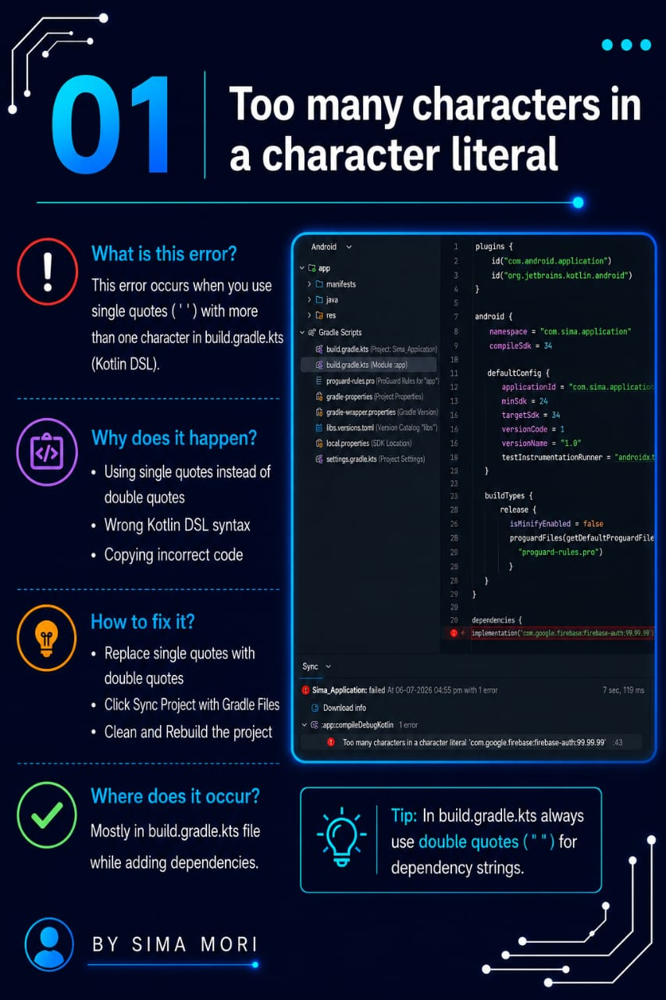

# 🚀 Episode 01: Too Many Characters in a Character Literal

## 📌 Error

```
Too many characters in a character literal
```

## ❓ Why This Error Occurs

This error occurs when multiple characters are enclosed in single quotes (`' '`).

In Java and Kotlin:

- Single quotes (`' '`) are used for a single character.
- Double quotes (`" "`) are used for strings.

## ❌ Incorrect Code

```java
char text = 'Hello';
```

## ✅ Correct Code

```java
String text = "Hello";
```

or

```java
char letter = 'H';
```

## 🛠️ Solution

- Use **single quotes** only for a single character.
- Use **double quotes** for words or sentences.
- Check all character literals in your code.

## 📷 Screenshots
### Final Result


### Error


### Explanation


### Solution


### Example


### Output


### Final Result


---

⭐ If this repository helped you, don't forget to **Star** it!

Happy Coding! 🚀
