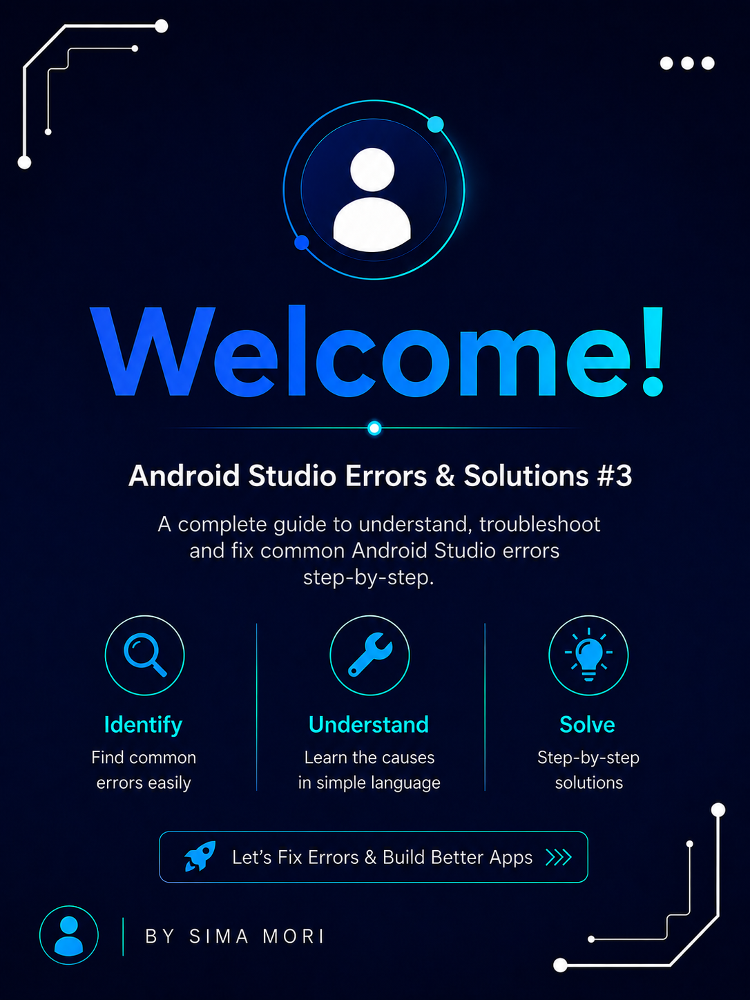
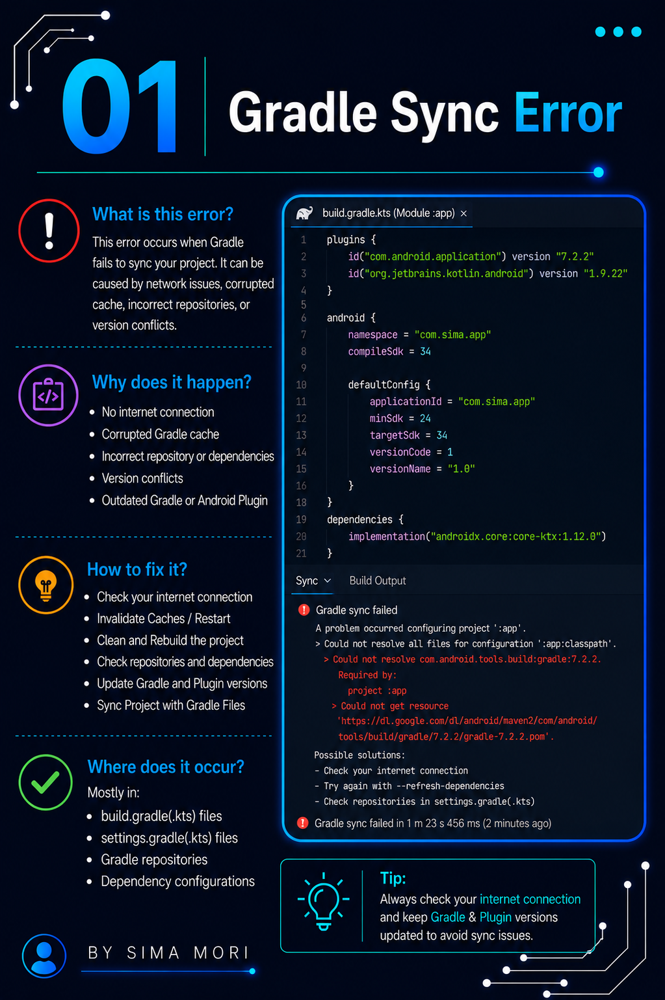
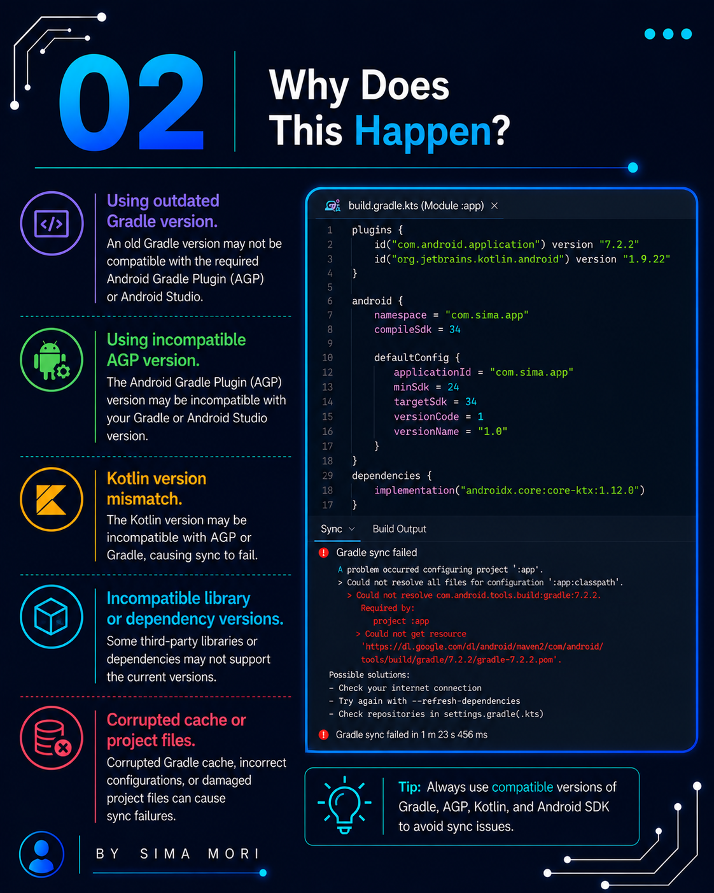
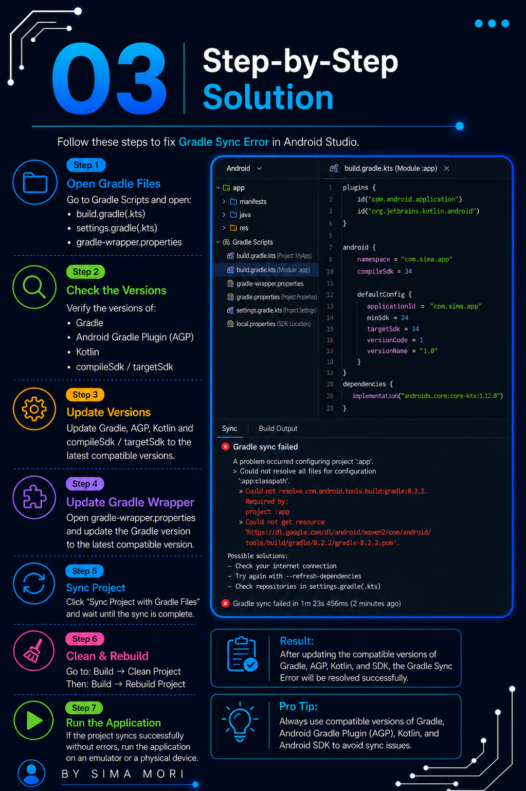
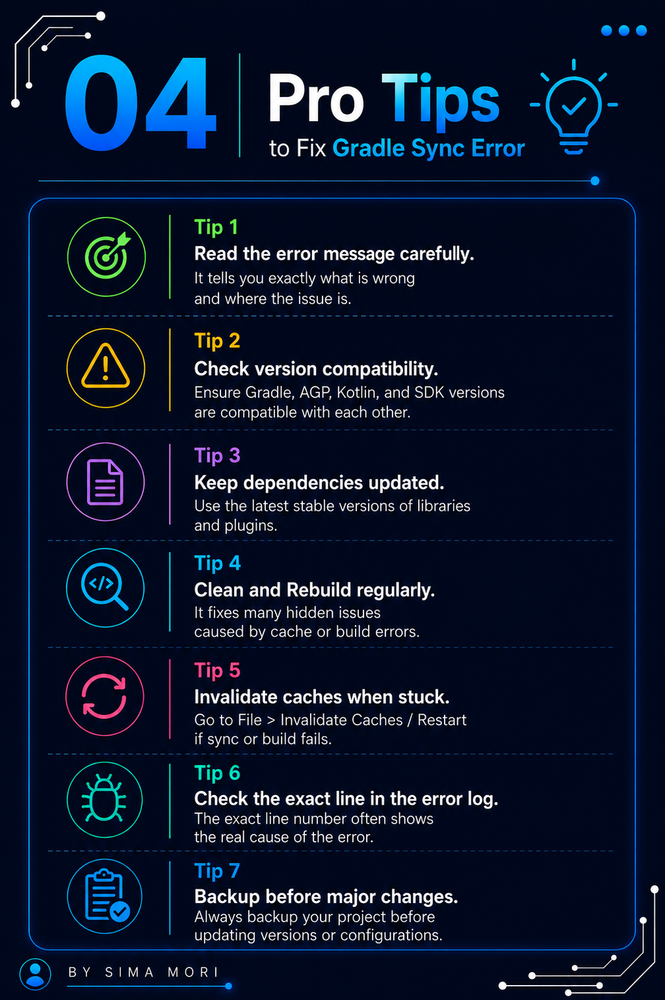
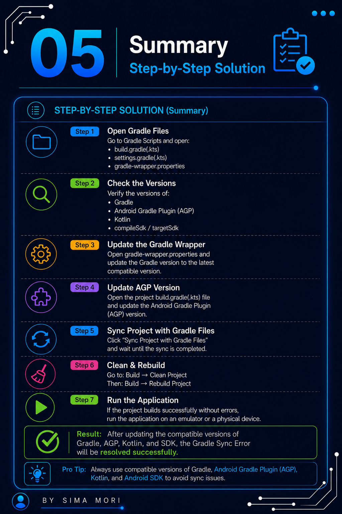

# 🚀 Episode 03: Gradle Sync Failed

## 📌 Error

```
Gradle Sync Failed
```

## ❓ Why This Error Occurs

This error occurs when Android Studio is unable to sync the project with Gradle.

Common reasons include:

- Incorrect Gradle or Android Gradle Plugin version.
- Internet connection issues.
- Corrupted Gradle cache.
- Missing or incompatible project dependencies.

## ❌ Common Issue

```gradle
Failed to sync Gradle project
```

## ✅ Correct Approach

```gradle
Sync Project with Gradle Files
```

Update Gradle, Android Gradle Plugin, and dependencies to compatible versions, then sync the project again.

## 🛠️ Solution

- Check your internet connection.
- Sync the project with Gradle files.
- Update the Gradle version if required.
- Update project dependencies.
- Clean and Rebuild the project.
- Invalidate Caches & Restart Android Studio.

## 📷 Screenshots

### Welcome 


### Error 


### Explanation


### Solution


### Example 


### Fix Applied


### Thanks


---

⭐ If this repository helped you, don't forget to **Star** it!

Happy Coding! 🚀
