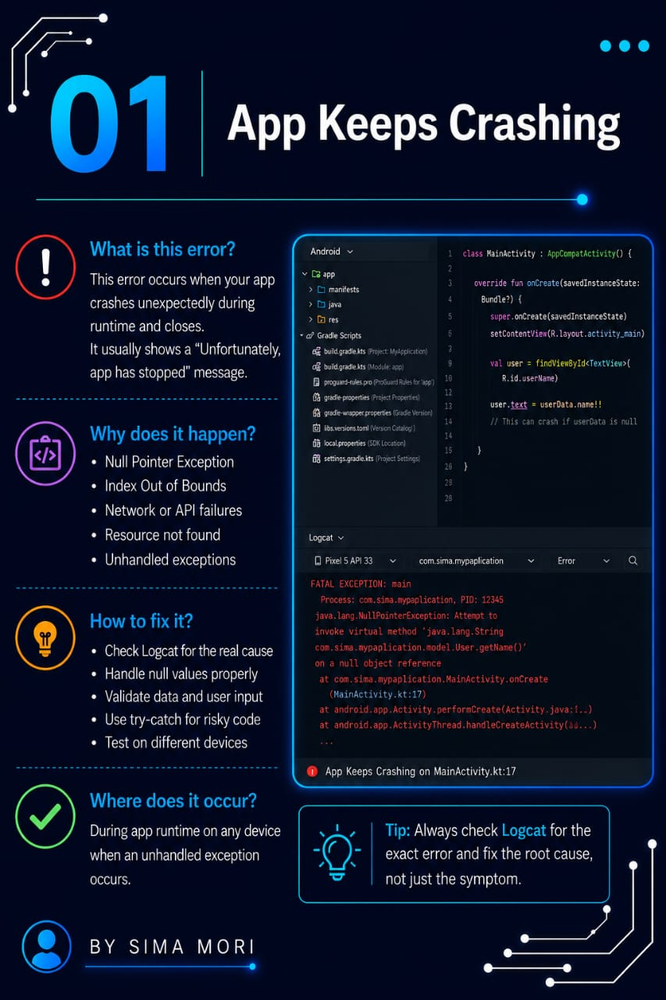
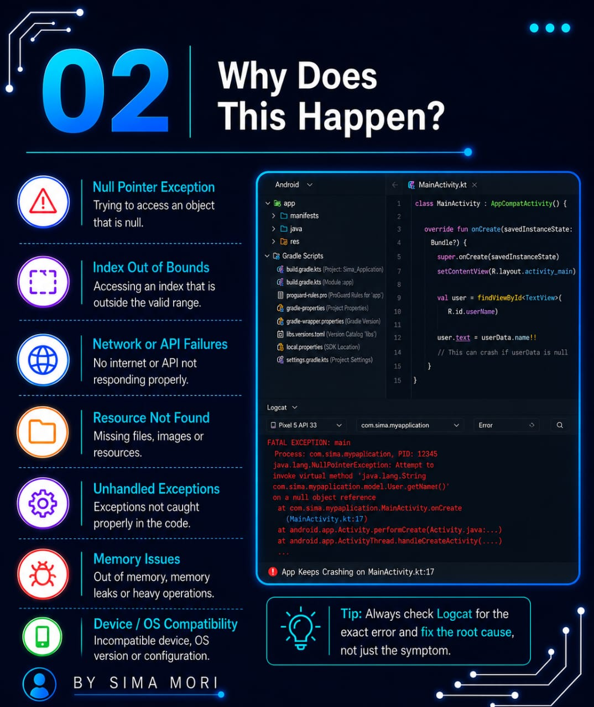
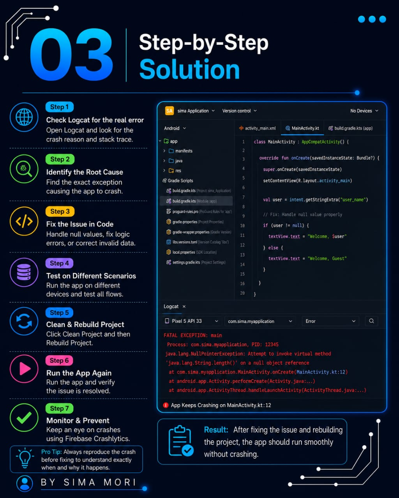
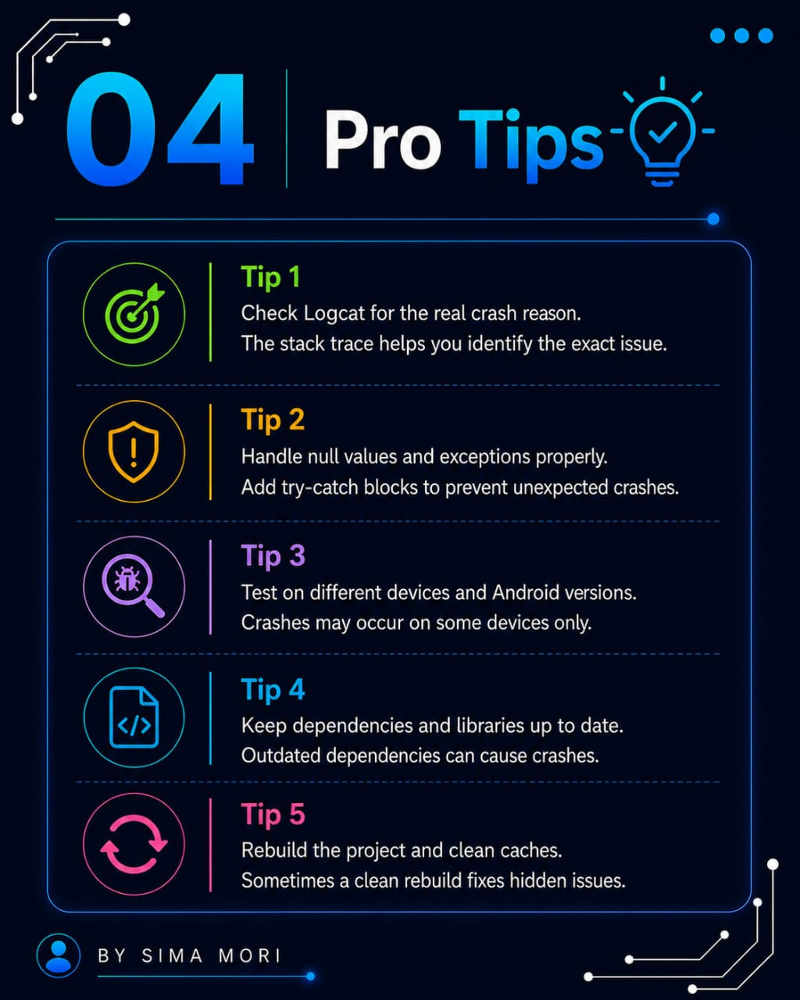
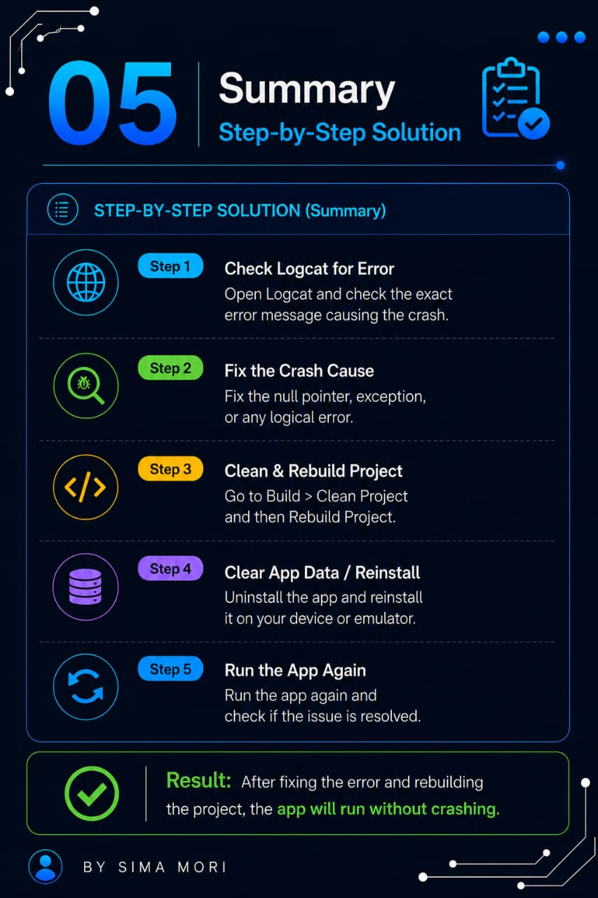

# 🚀 Episode 04: App Keeps Crashing

## 📌 Error

```
App Keeps Crashing
```

## ❓ Why This Error Occurs

This error occurs when the application crashes immediately after launching or while performing a specific action.

Common reasons include:

- Null Pointer Exception.
- Incorrect Activity or Fragment configuration.
- Missing resources or permissions.
- Invalid code logic or runtime exceptions.

## ❌ Common Issue

```java
java.lang.NullPointerException
```

## ✅ Correct Approach

```java
Check Logcat → Identify the exception → Fix the root cause → Rebuild and Run the project
```

Always use Logcat to identify the exact crash reason before applying a fix.

## 🛠️ Solution

- Check the Logcat error message.
- Fix the runtime exception.
- Verify Activities and Manifest configuration.
- Check resources and permissions.
- Clean and Rebuild the project.
- Run the application again.

## 📷 Screenshots

### Welcome 


### Error 


### Explantion 


### solution 


### Tips


### Summary 


### Thanks


---

⭐ If this repository helped you, don't forget to **Star** it!

Happy Coding! 🚀
